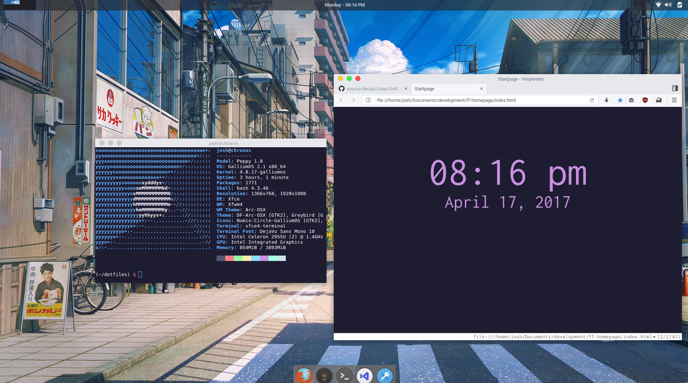

### My dotfiles for Linux. ###



Right now, I am ricing on an Acer C720 Chromebook running GalliumOS.

I am using GNU Stow to manage my dotfiles and you should as well.

#### How to get started: ####
1. Make a directory in your home directory where these dotfiles will live
2. From inside your newly created dotfile directory, run stow for the dotfile(s) you want
`stow <package name>` (for example, **stow vim**)
3. Stow will create a symlink for each file in the main folder (vim or bash, for example) based on the folder structure inside that application's folder. For example:

```
dotfiles/ (where dotfiles are stored)
| - zathura (name of application - only used in stow command)
|   | - .config/ (folders/files from here in are created by stow)
|   |   | - zathura/
|   |   |   | - zathurarc
```

running `stow zathura` would create a symlinked folder structure equivalent to this:

```
<your home directory>/
| - .config/
|   | - zathura/
|   |   | - zathurarc
```

4. That's all there is to it. Enjoy!
